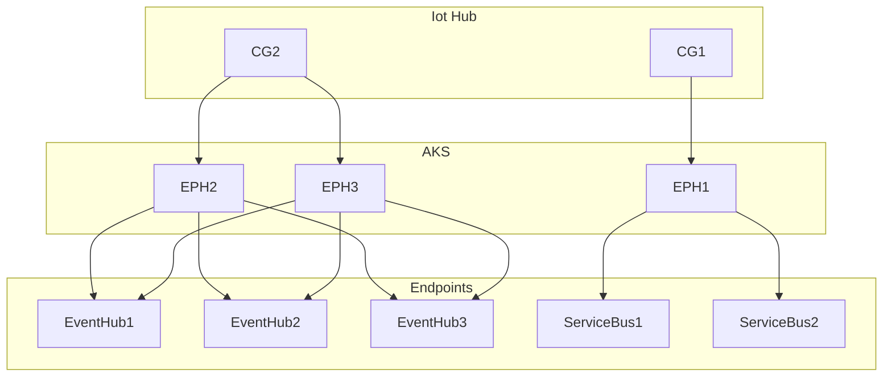

# IoT Hub high throughput routing

## Scenario

We want to egress the throughput of an Azure IoT S3 Hub into an AKS cluster hosted solution and route it to potentially 25 endpoints (Event Hubs and Service Bus).

The raw E2E throughput was tested against event hub, however, we used 2 consumer groups to make sure we egress two times.

The following diagram shows the architecture.



### Terms

- CG: Consumer Group
- EPH: EventProcessorHost

## Services and Components used

1. [Azure IoT Hub](https://azure.microsoft.com/en-us/services/iot-hub/)
1. [Azure Kubernetes Services (AKS)](https://docs.microsoft.com/en-us/azure/aks/)
1. [EventProcessorHost](https://docs.microsoft.com/en-us/azure/event-hubs/event-hubs-event-processor-host)
1. [Azure Event Hubs](https://azure.microsoft.com/en-us/services/event-hubs/)
1. [Azure Service Bus](https://azure.microsoft.com/en-us/services/service-bus/)

## Ingress / Egress capabilities

- [IoT Hub limits](https://docs.microsoft.com/en-us/azure/azure-resource-manager/management/azure-subscription-service-limits#iot-hub-limits)
- [Event Hub FAQ - Throughput units](https://docs.microsoft.com/en-us/azure/event-hubs/event-hubs-faq#throughput-units)

## Questions & Answers

### Egress capabilities

>What are the egress limitations of the internal Event Hub used by a single IoT Hub S3 instance?

The ingress (device to cloud) limits are documented in the [IoT Hub limits](https://docs.microsoft.com/en-us/azure/azure-resource-manager/management/azure-subscription-service-limits#iot-hub-limits). However, the egress is not.
The internal Event Hub of the IoT Hub can at least egress 2 x the ingress of the IoT hub. As long as there are not more than 2 consumer groups, the egress performance will be able to keep up with your ingress.

### Batching

>What's the ideal outputting strategy for Event Hubs? Are batches always superior?

Batching is the preferred way of sending messages. However, in that scenario, where 25 endpoints are potentially setup and assuming a message is only ever routed to a single endpoint, it is likely, you don't get more than 1 message for an endpoint. If you need to send to multiple endpoints parallel processing is key to get the required throughput. A good article for how you can achieve this: [Message transfers, locks, and settlement](https://docs.microsoft.com/en-us/azure/service-bus-messaging/message-transfers-locks-settlement)

### AKS configuration

>What scale is required in AKS to handle the load?

The best numbers under highest load we achieved using compute optimized Standard_F16s. We were able to get the number with a single node/single pod configuration. We can get similiar perf with F4s 3 nodes running 3 pods pumping messags. The only limiting factor is CPU. Stream processing incoming messages is no problem handling with this load, if you have catchup scenarios (longer downtime of the cluster), you may want to scale it for those scenarios or consider auto scaling.

### Throughput / number of messages

>What's the max throughput we can achieve?

We have tested with 500/1024 bytes messages (mixed) sending from 1000 devices 3 msg/s per device = 3000 msg/s. This is no problem processing for the cluster or the target event hub endpoints. If we stress the system and create a backlog, we were able to pump through 40K messages / s on average.

### Partition configuration

>How many partitions did we use on the IoT Hub

32

>How many partitions do we need on the target EventHub?

4

>How did we send the messages.

We used the source partition id of the IoT hub to determine where a particular message should be sent to. We have one processor per partition on the IoT Hub (by design). To ensure the messages for a particular device are sent to the same partition, we have to either group by device or use the source partition id. We chosen the later.

To ensure a better distribution we used a partition sender. To find out the configuration of the target event hub, we read the runtime information:

```csharp
var information = await eventHubClient.GetRuntimeInformationAsync();
var allPartitionIds = information.PartitionIds;
```

This allows us to setup partition senders for each partition of the target hub. When selecting a target partition we simply apply a modulus to select the target partition from the source partition id. That gave us much better balancing than simply using the source partition and let the hashing algo select the target partition for us.

Here is an example of the distribution of 1000 messages:

Using original hashing:

|Partition|Number of Messages|
|---------|------------------|
|1|286|
|2|181|
|1|187|
|1|346|

Using partition sender:

|Partition|Number of Messages|
|---------|------------------|
|1|249|
|2|262|
|1|247|
|1|242|

### Receiver batch & prefetch size

>What's the ideal batch- and prefetch size when using [EventProcessorHost](https://docs.microsoft.com/en-us/azure/event-hubs/event-hubs-event-processor-host) to read the messages?

When processing the normal 3K messages/s the batch size can be 50 and the prefetch size 100 and you are getting enough throughput to process the messages. However, when you have a large backlog to process larger sizes make sense. We ended up using

```csharp
MaxBatchSize = 1000;
PrefetchCount = 2000;
```

That allows the system to read 40K messages/second.

### Pod instances

> How many instances should we run?

We used a configuration with 3 nodes, 1 pod each. That's for availability purpose. You can process the messages with a single pod, if the nodes are scaled accordingly and you are not CPU bound, but we would recommend using multiple pods.

## Message processing test results

|Number of Cores|CPU utilization|MaxBatchSize|PrefetchCount|Avg Msg/s|Median
|-:|-:|-:|-:|-:|-:|
|8|0.67|100|200|17'700|18'200|
|8|0.89|1000|2000|26'373|27'423|
|16|0.81|1000|2000|40'922|44'019|

>Note: we were clearly CPU bound. Once increasing the number of cors we were able to process a significant amount of messages. Nor egress nor ingress were a problem.
